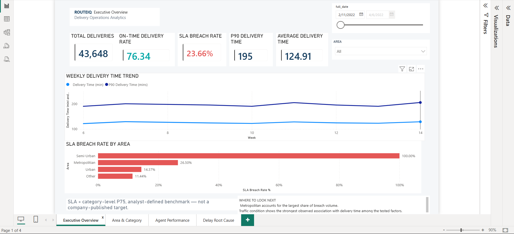
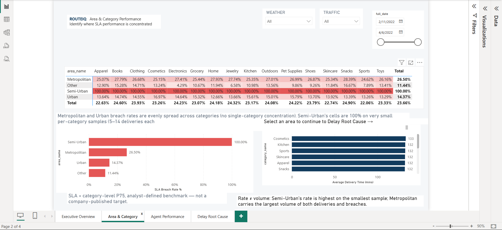
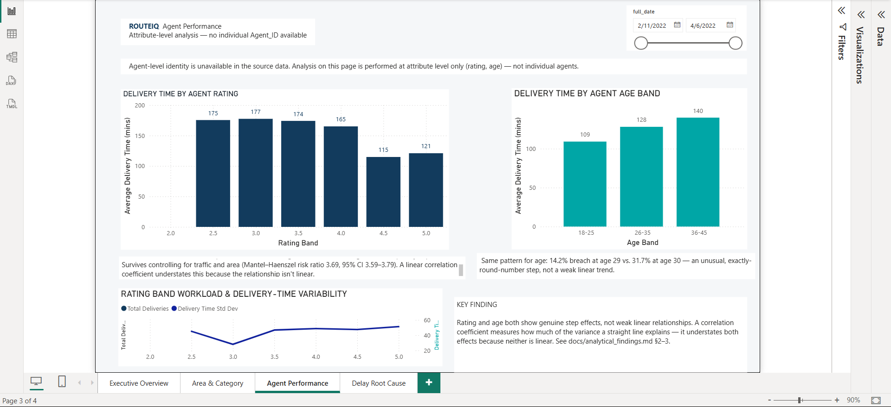

<div align="center">

# RouteIQ — Delivery Operations Analytics

**A Data Analyst / BI project: PostgreSQL, SQL, Python and Power BI, used to find where delivery
SLA breaches concentrate and what conditions are associated with them.**


</div>

<p align="center">
  
</p>

An end-to-end delivery operations analytics project using PostgreSQL, SQL, Python and Power BI to
identify SLA breaches, operational bottlenecks and performance patterns across traffic, weather, time
of day and delivery segments. **This is a Data Analyst / Business Intelligence project** — cleaning,
SQL, descriptive and diagnostic analysis, and a BI report. It deliberately does not use machine learning,
predictive modelling or causal inference (see `docs/methodology.md`).

## Business problem

A last-mile delivery operation wants to know: how much of its delivery volume misses its expected
delivery-time benchmark, where that risk concentrates, and which operational conditions are associated
with it — using only the data actually available (no cost data, no agent identifiers, no company-set
SLA).

## Business questions

1. What is the overall delivery performance (total volume, on-time rate, breach rate, P90)?
2. Where are breaches concentrated — by area, traffic, weather, and their combination?
3. When do breaches happen — is there a time-of-day pattern?
4. What operational factors are associated with longer deliveries or higher breach rates?
5. How does agent rating relate to delivery performance, and does a simple correlation capture it?
6. How sensitive are the conclusions to the SLA definition itself?
7. Which segments should operations investigate first, and what can't be concluded from this data?

## Key findings

*Associations observed in this dataset — never causal claims. Full detail with every figure sourced:
[`docs/analytical_findings.md`](docs/analytical_findings.md).*

| Finding | Result |
|---|---|
| Overall breach rate | **23.66%** (10,328 of 43,648 deliveries), against an analyst-defined P75 benchmark |
| Agent rating | A **step**, not a slope: 63.2% breach at rating 4.4 vs. 10.5% at rating 4.5 — a 52.7-point jump that survives controlling for traffic and area (stratified risk ratio 3.69) |
| Agent age | The same pattern: 14.2% (age 29) vs. 31.7% (age 30) — an unusual, exactly-round-number step |
| Time of day | The 17:00–23:59 evening peak is 72% of deliveries but **89%** of breaches |
| Traffic × time of day | 97.5% overlap — the dataset cannot cleanly separate the two |
| Where volume concentrates | Metropolitian holds 83.7% of breach volume on 74.8% of delivery volume — mostly volume, not an unusually high rate |
| Smallest, most extreme rate | Semi-Urban: **100%** breach rate, but only **n = 152** |
| Preparation time | **No association** with breach or delivery time (Cramér's V = 0.006) |
| Weekend vs. weekday | **No difference** — a clean null result |
| Is this real data? | Several patterns (95% of times are multiples of 5, exact-round-number steps, a perfect 100% rate) point to a realistic **synthetic-style** dataset — disclosed, not hidden ([`docs/limitations.md`](docs/limitations.md)) |

## Dashboard

<table>
  <tr>
    <td></td>
    <td></td>
  </tr>
  <tr>
    <td colspan="2"></td>
  </tr>
</table>

These are screenshots of the actual report (not design mockups). The report is being rebuilt to a
5-page structure with a live SLA sensitivity parameter, drillthrough and dynamic text — the full spec
and current gap list are in [`powerbi/README.md`](powerbi/README.md) and
[`docs/dashboard_guide.md`](docs/dashboard_guide.md).

## Technical workflow

```
Raw data (Kaggle, 43,739 rows)
    -> Python cleaning + feature engineering
    -> Cleaned dataset (43,648 rows)
    -> PostgreSQL star schema
    -> Controlled analytical view (Python + SQL, one definition each)
    -> SQL analysis (29 queries) + Python descriptive/diagnostic analysis
    -> Cross-layer KPI reconciliation (4 independent recomputations)
    -> Power BI report + DAX
    -> Business recommendations
```

Data model: one fact table (`FactDelivery`) and six dimensions
(`sql/schema/`, [`docs/data_dictionary.md`](docs/data_dictionary.md)). Included to demonstrate
dimensional modelling and BI-model discipline — a single flat table would work equally well for this
dataset's size; see [`docs/methodology.md`](docs/methodology.md) for the honest framing.

## Tech stack

PostgreSQL 18 · SQL (CTEs, window functions, `PERCENTILE_CONT`, `LAG`, conditional aggregation) · Python
(pandas, NumPy, SciPy, Matplotlib) · Power BI (DAX) · pytest · Git/GitHub.

## Repository structure

```
.
├── README.md, requirements.txt, pytest.ini
├── data/
│   ├── raw/            amazon_delivery.csv (not redistributed — see data/README.md)
│   └── processed/      cleaned_delivery.csv (43,648 rows), sla_reference.csv, analytical_deliveries.csv
├── sql/
│   ├── schema/          01-09: star schema + the controlled analytical view
│   ├── analysis/         Q01-Q29 business-question queries
│   └── validation/       Cross-cutting test suite
├── src/routeiq/
│   ├── cleaning/         Raw -> cleaned pipeline
│   ├── features/         The controlled analytical dataset (one definition per feature)
│   ├── analysis/         Segments, time-of-day, prep-time, thresholds, SLA sensitivity, scenarios, figures
│   ├── statistics/       Effect-size helpers (Wilson CI, risk/odds ratio, Cramér's V, Mantel-Haenszel, Cohen's d)
│   └── validation/       Data-quality checks, independent recompute, cross-layer reconciliation
├── notebooks/            01_data_quality, 02_eda, 03_operational_analysis, 04_kpi_validation
├── tests/                46 pytest tests
├── scripts/              run_analysis.py, run_sql.py, run_all.py
├── powerbi/              RouteIQ_v1.pbix, screenshots/, README.md (measures + page spec)
└── docs/
    ├── methodology.md, data_dictionary.md, analytical_findings.md
    ├── limitations.md, recommendations.md, dashboard_guide.md
    └── archive/          Prior-phase planning docs, validation reports, and the earlier analysis version
```

## Data quality and validation

- **Data-quality gates:** row count, uniqueness, category membership, numeric ranges, SLA-threshold
  consistency — `src/routeiq/validation/data_quality.py`, enforced by `tests/test_data_quality.py`.
- **Cross-layer KPI reconciliation:** the same KPIs computed four independent ways (plain Python, the
  pandas pipeline, PostgreSQL, and the deployed Power BI report). **121 of 122 checked metrics agree
  exactly** — the one exception is a documented Power BI tie-handling issue
  ([`docs/limitations.md`](docs/limitations.md)). This is reconciliation, not proof of correctness.
- **Automated tests:** `pytest` — 46 tests covering data quality, feature definitions, effect-size
  calculations against known answers, and the reconciliation itself.

```bash
pytest
```

## Reproduce it

```bash
pip install -r requirements.txt
python scripts/run_analysis.py     # rebuilds the analytical dataset, tables, figures, results.json
jupyter lab notebooks              # 01-04, already executed with their outputs saved
```

To also run the SQL layer, connect a PostgreSQL 18 instance (`sql/schema/01`–`09` in order), set the
standard `PG*` environment variables, and run `python scripts/run_sql.py`. Full steps, including the raw
data source: [`docs/methodology.md`](docs/methodology.md).

## Limitations

Full detail in [`docs/limitations.md`](docs/limitations.md). In short: treat this as a realistic
synthetic-style dataset, not verified real operations; no agent identifier exists (attribute-level only);
`bicycle` has 0 rows after cleaning; the SLA is an analyst-defined benchmark, not a company target; no
cost/revenue data exists, so no financial impact is estimated anywhere.

## Documentation index

| Where | What |
|---|---|
| [`docs/methodology.md`](docs/methodology.md) | Pipeline, SLA definition, descriptive methods used and why, reproduction steps |
| [`docs/data_dictionary.md`](docs/data_dictionary.md) | Every column, every derived feature, the star schema |
| [`docs/analytical_findings.md`](docs/analytical_findings.md) | Every finding, with its source query/notebook |
| [`docs/limitations.md`](docs/limitations.md) | Data realism, agent-attribute caveats, statistical scope, known discrepancy |
| [`docs/recommendations.md`](docs/recommendations.md) | Finding → Evidence → Action → KPI → Limitation, for every recommendation |
| [`docs/dashboard_guide.md`](docs/dashboard_guide.md), [`powerbi/README.md`](powerbi/README.md) | The dashboard page-by-page, DAX measures, current gaps |
| [`docs/archive/`](docs/archive) | Prior-phase planning docs, validation reports, and the earlier (v1) analysis code |

## Data source

Built on the public [Amazon Delivery Dataset](https://www.kaggle.com/datasets/sujalsuthar/amazon-delivery-dataset)
by sujalsuthar on Kaggle. The raw file is not redistributed in this repo; see the dataset page for its
licence terms and `data/README.md` for how to obtain it.

## Author

**Vitthal Misal** · GitHub [@Vitthal38](https://github.com/Vitthal38)
