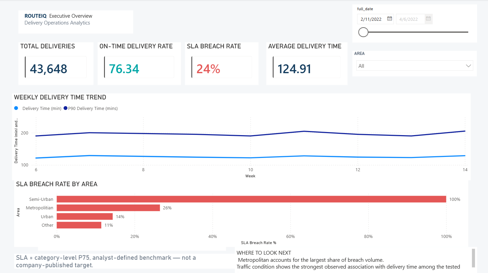
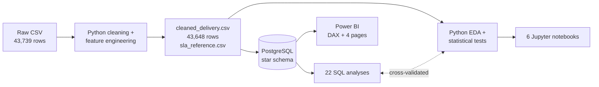
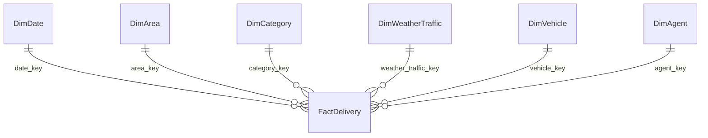
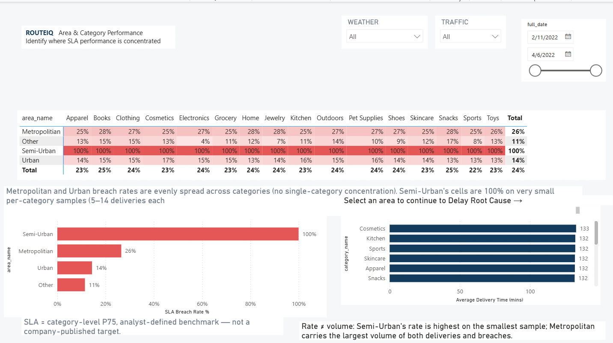
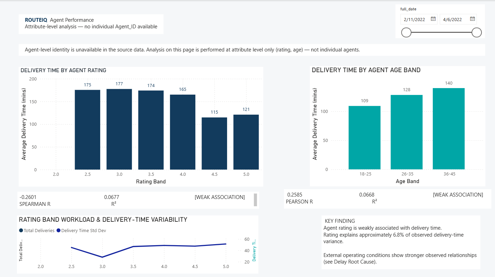
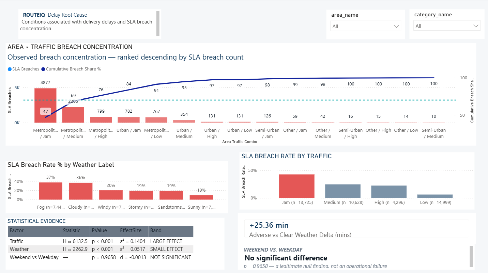

<div align="center">

# RouteIQ — Delivery Operations Analytics

**Where do last-mile delivery SLA breaches concentrate, and which conditions are associated with delays?**


</div>

<p align="center">
  
</p>

## Overview

RouteIQ is an end-to-end analytics project on **43,648 deliveries** (11 Feb – 6 Apr 2022). It runs the full analyst workflow: clean the data in Python, model it as a PostgreSQL star schema, answer 22 business questions in SQL, test the patterns statistically, and present the result as a 4-page Power BI report. Every headline number was reconciled across SQL, Python and DAX with **0 discrepancies**.

## Headline results

*These are observed associations, not causal claims.*

| Finding | Result |
|---|---|
| SLA breach rate | **23.66%** (10,328 of 43,648 deliveries) |
| Traffic | Strongest association with delivery time: Kruskal-Wallis ε² = **0.1404** (large). Jam breaches 42.58% of the time versus 6.08% for Low traffic. |
| Weather | Statistically significant but small: ε² = **0.0517**. Adverse weather averages **+25.36 min** versus Sunny. |
| Weekend vs. weekday | **No significant difference** (p = 0.9658, d = −0.0013). |
| Where breach volume sits | Metropolitian holds **83.73%** of breach volume (74.8% of deliveries). Metropolitian / Jam traffic alone is 47.22%, and the top four area × traffic combinations reach 83.88%. |
| Highest breach *rate* | Semi-Urban at **100%**, but on only **n = 152** deliveries (0.35%), so treat it with caution. |
| Agent attributes | Weak: rating Spearman r = −0.2601 (r² = 0.0677); age Pearson r = 0.2585 (r² = 0.0668). |

## How it was built



### Data model

One fact table (`FactDelivery`) and six dimensions, all one-to-many with single-direction filtering. `DimAgent` is built from rating and age attributes only, because the source has no agent identifier.



### SLA definition (fixed up front, never recalculated)

- `sla_threshold_minutes` is the **75th percentile (P75) of delivery time within each product category**.
- A delivery **breaches** when `Delivery_Time > sla_threshold_minutes`. Strictly greater than: equal to the threshold is on time.
- This is an analyst-defined benchmark, not a company-published target. Every SQL, Python and DAX figure reads the stored flag.

## Power BI report

`route iq.pbix` contains the model and four pages:

| Page | Answers |
|---|---|
| **Executive Overview** | Are we meeting the benchmark, and is it trending? KPI cards, weekly average and P90 trend, breach rate by area. |
| **Area & Category** | Where is the problem? Area × category breach-rate heatmap, area ranking, category delivery time. |
| **Agent Performance** | Do agent rating and age matter? Attribute-level only, with weak-association captions. |
| **Delay Root Cause** | Which conditions concentrate breaches? Area × traffic Pareto, weather and traffic breach rates, statistical evidence. |

<table>
  <tr>
    <td></td>
    <td></td>
  </tr>
  <tr>
    <td colspan="2"></td>
  </tr>
</table>

Design references for the visual system (navy `#123B5D` for structure, teal `#00A6A6` for on-time, coral `#E45756` for breach only) are in [`output/dashboard_mockups/`](output/dashboard_mockups). The measure library is in [`dax/measures.dax`](dax/measures.dax) and the model spec in [`dax/model_relationships.md`](dax/model_relationships.md).

## Repository structure

```
.
├── README.md, requirements.txt
├── *.md                      Planning docs: charter, KPIs, SLA methodology, star schema, test plan, ...
├── data/cleaned/             cleaned_delivery.csv (43,648 rows), sla_reference.csv (16 category thresholds)
├── python/
│   ├── main.py               Phase 1 pipeline: load, profile, clean, engineer features, validate
│   ├── analysis/             01-06: EDA, segments, correlation + Pareto, statistical tests, cross-validation
│   └── notebooks/            01-06 Jupyter notebooks (executed, with outputs)
├── sql/
│   ├── schema/               01-08: schema, dimensions, fact, constraints, indexes, loads, validation
│   └── analysis/             Q01-Q22 business-question queries + final test suite
├── dax/                      measures.dax, model_relationships.md
├── route iq.pbix             Power BI report
├── output/                   eda_summary.json, statistical_test_results.json, pareto_ranking.csv, figures/
├── docs/                     Data dictionary, ERD, SQL guide, dashboard blueprint, executive recommendations
└── reports/                  Profiling, cleaning, validation, audit, findings and cross-validation reports
```

## Reproduce it

**1. Environment**
```bash
pip install -r requirements.txt
```

**2. Python analysis and notebooks.** The approved cleaned data is already in `data/cleaned/`, so you can start here.
```bash
jupyter lab python/notebooks          # 01_eda_overview ... 06_sql_cross_validation
```
To rerun the scripts instead, execute `python/analysis/01_...py` to `06_...py` in order (they write to `output/`).

**3. Optional: rebuild the cleaned data.** Download `amazon_delivery.csv` from [Kaggle](https://www.kaggle.com/datasets/sujalsuthar/amazon-delivery-dataset), place it in the project root, then run `python python/main.py`.

**4. PostgreSQL star schema.** Run `sql/schema/01` to `08` in order with `psql -U postgres -f <file>`. Script `06` needs the absolute paths to the two CSVs (server-side `COPY`):
```bash
psql -U postgres \
     -v cleaned_csv="/abs/path/data/cleaned/cleaned_delivery.csv" \
     -v sla_csv="/abs/path/data/cleaned/sla_reference.csv" \
     -f sql/schema/06_load_dimensions.sql
```
Everything lives in the `routeiq` schema of the default `postgres` database. Business queries are in `sql/analysis/`.

**5. Power BI.** Connect to `localhost:5432`, database `postgres`, schema `routeiq`, and import the seven tables (not the `stg_*` staging tables). Create the measures from `dax/measures.dax` (in Power BI Desktop use `=` instead of the file's `:=`). `DimDate` is intentionally **not** marked as a date table: it holds only the 44 observed dates, so Power BI's contiguity check fails, and no measure uses time intelligence.

## Validation and rigor

- **Three-way reconciliation:** SQL, Python and DAX agree on every checked figure ([`reports/python_sql_cross_validation.md`](reports/python_sql_cross_validation.md), [`reports/dax_validation.md`](reports/dax_validation.md)).
- **Audited SQL:** the 22 queries went through a senior audit and remediation pass ([`reports/sql_senior_audit.md`](reports/sql_senior_audit.md)).
- **Statistics done properly:** each test follows a documented decision tree (Shapiro-Wilk, Levene, then ANOVA/Kruskal-Wallis or t/Mann-Whitney). Effect sizes are reported, not just p-values ([`reports/statistical_analysis_report.md`](reports/statistical_analysis_report.md)).
- **Frozen inputs:** the SLA rule and the cleaned dataset are never modified after approval.

## Limitations

- **No agent identifier** in the source data: analysis is by rating and age attributes, never individual agents.
- **No bicycle deliveries** survive cleaning, so bicycle is not analysed.
- **Short window:** about 8 weeks, with a real 10-day gap (19–28 Feb 2022), which limits trend claims.
- **Small sample:** Semi-Urban's 100% breach rate rests on 152 deliveries.
- **Analyst-defined SLA:** breach and on-time rates are relative to the P75 benchmark.
- **No causal claims:** results are associations. No interaction test between weather and traffic was run.
- `Metropolitian` is the spelling stored in the source data and is kept verbatim.

## Data source

Built on the public [Amazon Delivery Dataset](https://www.kaggle.com/datasets/sujalsuthar/amazon-delivery-dataset) by sujalsuthar on Kaggle. The raw file is not redistributed in this repo; see the dataset page for its licence terms. `data/cleaned/` contains the derived, cleaned version used by every analysis here.

## Documentation index

| Where | What |
|---|---|
| [`PROJECT_CHARTER.md`](PROJECT_CHARTER.md), [`BUSINESS_REQUIREMENTS.md`](BUSINESS_REQUIREMENTS.md), [`KPI_DEFINITIONS.md`](KPI_DEFINITIONS.md) | Goals, stakeholders, KPI definitions |
| [`SLA_METHODOLOGY.md`](SLA_METHODOLOGY.md), [`STATISTICAL_ANALYSIS.md`](STATISTICAL_ANALYSIS.md) | The SLA rule and the statistical test plan |
| [`docs/`](docs) | Data dictionary, ERD, SQL implementation guide, dashboard blueprint, executive recommendations |
| [`reports/`](reports) | Profiling, cleaning, validation, audit and findings reports |

## Author

**Vitthal Misal** · GitHub [@Vitthal38](https://github.com/Vitthal38)
