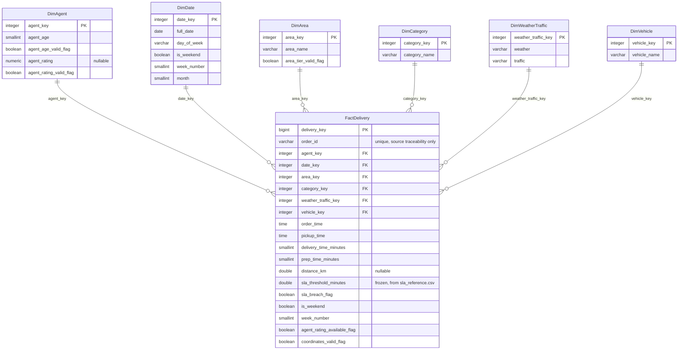

# Database ER Diagram — RouteIQ Phase 2

Generated: 2026-08-16

This diagram reflects the **actually implemented** PostgreSQL schema in
the `routeiq` schema, verified against live `information_schema` /
`pg_constraint` output in `reports/sql_schema_validation.md`. Every
relationship shown below corresponds to a real, enforced foreign key —
none is aspirational or planned-but-not-built.

All relationships are one-to-many, dimension → fact, matching
`STAR_SCHEMA.md`'s documented cardinality (each delivery has exactly one
agent-attribute combination, one date, one area, one category, one
weather/traffic combination, one vehicle).

## Notes

- **`DimAgent` is an attribute-derived dimension, not a true agent
  entity.** The diagram's `agent_key` PK is a technical surrogate for a
  distinct `(agent_age, agent_rating)` combination — there is no source
  `Agent_ID`, and this relationship must not be read as "each delivery
  belongs to one individual agent" in the way the other five relationships
  genuinely represent a real-world attribute of the order.
- **`DimWeatherTraffic` is a single combined dimension**, per
  `STAR_SCHEMA.md`'s documented design decision — this diagram does not
  show separate Weather/Traffic dimensions because none were built.
- **No snowflaking.** Every dimension joins directly to `FactDelivery`;
  no dimension references another dimension, matching `STAR_SCHEMA.md`'s
  "star, not snowflake" design philosophy.
- **Cardinality:** every relationship is `||--o{` (exactly one dimension
  row to zero-or-more fact rows) — in practice every dimension row that
  exists has at least one fact row, since dimensions were populated by
  `SELECT DISTINCT` over the same rows loaded into `FactDelivery`.
